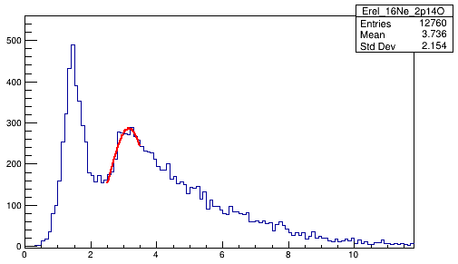
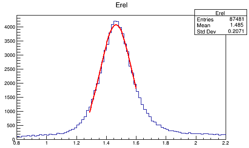
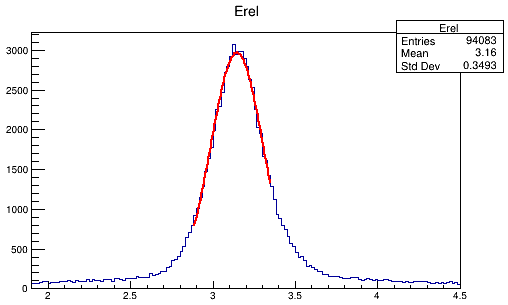
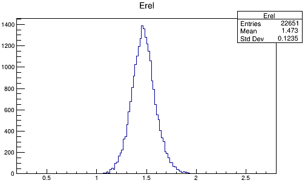
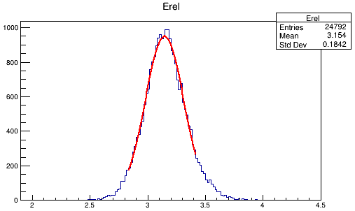

# Ne16模拟

目录：~/code/sims/Ne16

[TOC]

  

## 191023

### 2019/10/21

#### 1. 修改代码，可以得到正确的mean值

删除质子能量重建时在Si和Al中的能损语句：

```C++
frag1.recon->energy = loss_HinSi.getEin(frag1.recon->energy,235.37);
frag1.recon->energy = loss_HinAl.getEin(frag1.recon->energy,1599.584);
frag1.recon->getVelocity();
```

仅保留在靶里的能损：

```C++
frag1.Egain(thickness/2.);
```

#### 2. 结果

- 实验结果



<center>基态        Mean：1.46432     Sigma：2.88343e-01<center>


<center>激发态    Mean：3.16228    Sigma：5.88206e-01<center>


- 基态模拟

  

  <center>Mean：1.46422          Sigma：1.05625e-01<center>

- 激发态模拟

  

  <center>Mean：3.14569          Sigma：1.59360e-01<center>

#### 3. To do

- [x] 看Kyle文章和博士论文Ne16两个能级的宽度和模拟方法

  > 基态能级宽度<80keV，激发态没有说明。模拟时调节了靶的有效厚度。

- [x] 搞明白mean值变正确的原因，把分辨率调到和实验值一致。

  > 在frag::hit10()中没有考虑质子在在Al和Si中能损，而是直接将它们的能量歧离纳入CsI的分辨中，之后在重建时仅考虑质子在靶里的能损。所以删除我自己加的重建质子在Si和Al中的能损语句，即可得到正确的Ne16峰位。
  >
  > ```C++
  > recon->energy = real->energy + sqrt(real->energy)*CsI_res*ran.Gaus(0.,1.);  //in frag::hit10()
  > ```

### 2019/10/23

#### 1. 整理sim.cpp文件

- 将sim.cpp中输出文件和histogram的定义，移动到新增类histo中（参考sort程序做法）。

- 改变变量的定义顺序，使程序更易读。

#### 2. 修改sim.cpp，加上末态3体接收条件 

```C++
if (nhit != 3) continue;
```

此时可以得到探测效率~25%，并且之前两边的拖尾消失。



<center>mean: 1.466  sigma: 0.1097</center>



 

<center>mean: 3.136    sigma: 0.167</center>

#### 3. 组会讨论结果

1. 三体情况下中心位置是正确的，可以不再继续进行Ne16单独的模拟。如何调参数，使得Mg18分辨率和实验值相同即可。
2. 模拟3体，4体，过渡到5体。找出现在mean值不对的原因。

## 200711

在Mg19/200623的版本上修改，进行16Ne模拟，以检验模拟代码的可靠性，并调节模拟参数。

修改参数

* sim.cpp
  * **double Qbreakup：衰变能**
  * bool einstein：0代表非相对论，1代表相对论，我们这里都使用相对论
  * const int Nevents：模拟事件数
  * const int nFrags：衰变末态粒子数
  * double Abeam：次级束质量数A
  * double Zbeam：次级束原子序数Z
  * double EPAbeam：次级束能量，单位MeV/A
  * double mbeam：次级束质量，单位MeV/c2
  * double P_acceptanc：次级束动量接收度
  * double beamSize：打在靶上的束斑大小
  * double thickness = 1000.; //1mm 9Be [micron]
  * double thickness_Al = 5920; //5.92mm Al [micron]
  * double thickness_Si = 1014; //1014um Si [micron]
  * double dist = 352;// [mm]靶离Si的距离
  * double csiRes = 0.1275;
  * double thickness_CsI = 50; //50mm CsI [mm]
  * **CPlf定义里：Zbeam,mass_20Mg,mass_16Ne,"Mg20inBe"**
  * **CFrag定义里：Z, mass**